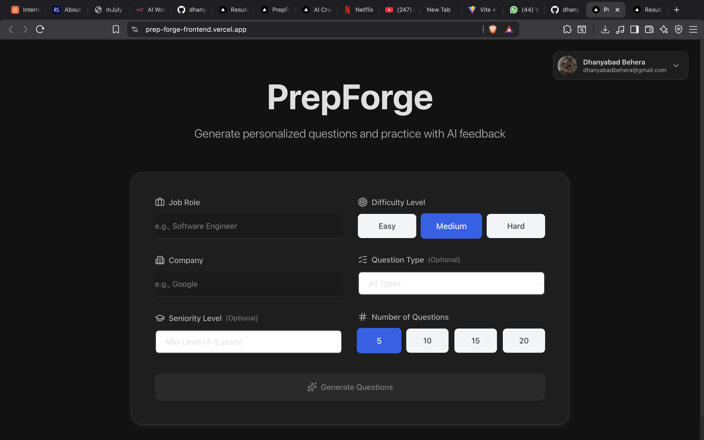
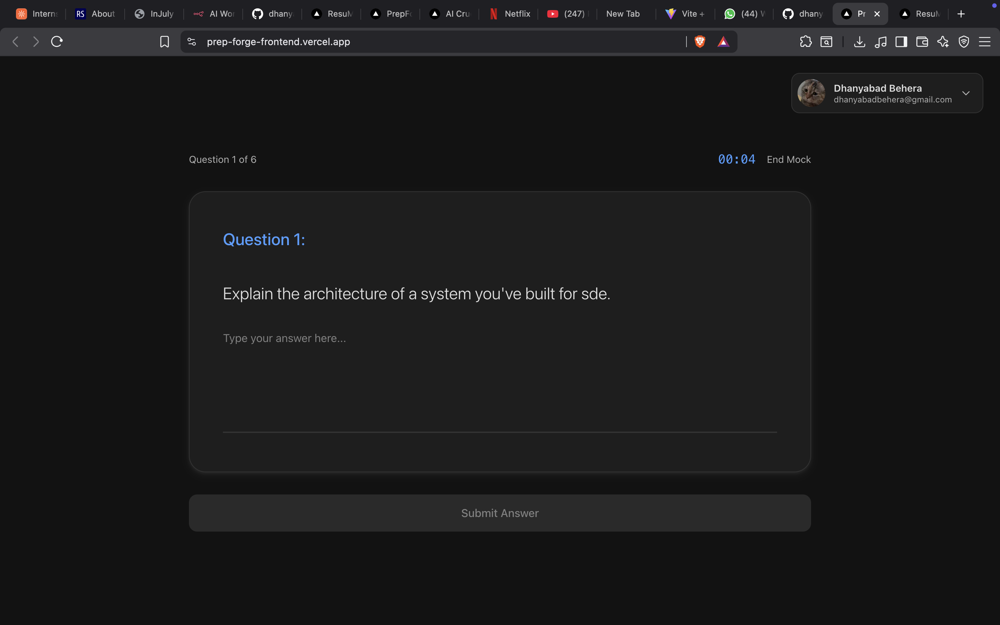

# 🎯 PrepForge Frontend

An AI-powered interview preparation platform that helps you practice and ace your technical interviews. Built with Next.js 15, TypeScript, and Tailwind CSS.

## 📸 Screenshots

### Dashboard Overview


_Main dashboard showing interview history, analytics, and quick actions_

### Interview Practice


_Interactive interview session with AI-generated questions and real-time feedback_

### Questions


_Detailed analytics tracking your performance and progress over time_

## ✨ Features

-   🤖 **AI-Powered Questions**: Generate customized interview questions based on your role and difficulty level
-   💬 **Real-time Feedback**: Get instant AI feedback on your interview responses
-   📊 **Analytics Dashboard**: Track your progress with detailed performance metrics
-   🔐 **Secure Authentication**: NextAuth.js integration for secure user sessions
-   🎨 **Modern UI**: Clean, responsive interface built with Tailwind CSS
-   📈 **Progress Tracking**: Visualize your improvement with interactive charts
-   🌙 **Dark Mode Ready**: Beautiful interface that's easy on the eyes

## 🛠️ Tech Stack

-   **Framework**: [Next.js 15](https://nextjs.org/) (App Router)
-   **Language**: [TypeScript](https://www.typescriptlang.org/)
-   **Styling**: [Tailwind CSS](https://tailwindcss.com/)
-   **Authentication**: [NextAuth.js](https://next-auth.js.org/)
-   **Charts**: [Recharts](https://recharts.org/)
-   **Icons**: [Lucide React](https://lucide.dev/)
-   **Database Adapter**: Prisma with NextAuth

## 🚀 Getting Started

### Prerequisites

-   Node.js 18+ installed
-   npm, yarn, pnpm, or bun package manager

### Installation

1. **Clone the repository**

    ```bash
    git clone https://github.com/dhanyabad11/PrepForge-Frontend.git
    cd PrepForge-Frontend
    ```

2. **Install dependencies**

    ```bash
    npm install
    # or
    yarn install
    # or
    pnpm install
    ```

3. **Set up environment variables**

    Create a `.env.local` file in the root directory:

    ```env
    NEXTAUTH_URL=http://localhost:3000
    NEXTAUTH_SECRET=your-secret-key
    DATABASE_URL=your-database-url
    # Add your AI API keys here
    ```

4. **Run the development server**

    ```bash
    npm run dev
    # or
    yarn dev
    # or
    pnpm dev
    ```

5. **Open your browser**

    Navigate to [http://localhost:3000](http://localhost:3000)

## 📁 Project Structure

```
frontend/
├── src/
│   ├── app/                    # Next.js App Router pages
│   │   ├── analytics/          # Analytics dashboard
│   │   ├── api/                # API routes
│   │   │   ├── auth/           # Authentication endpoints
│   │   │   ├── generate-feedback/
│   │   │   └── generate-questions/
│   │   ├── auth/               # Auth pages
│   │   ├── dashboard/          # Main dashboard
│   │   ├── interview/          # Interview session pages
│   │   └── page.tsx            # Home page
│   ├── components/             # React components
│   │   ├── AuthProvider.tsx
│   │   ├── Dashboard.tsx
│   │   ├── LoadingSpinner.tsx
│   │   └── UserMenu.tsx
│   └── lib/                    # Utilities and configs
│       └── auth.ts             # NextAuth configuration
├── public/                     # Static assets
│   └── screenshots/            # App screenshots
└── package.json
```

## 🎯 Key Features Explained

### AI Question Generation

The platform uses AI to generate relevant interview questions based on:

-   Selected job role
-   Difficulty level (Easy, Medium, Hard)
-   Interview type (Technical, Behavioral, System Design)

### Intelligent Feedback System

Get constructive feedback on your responses including:

-   Strengths and weaknesses analysis
-   Suggestions for improvement
-   Performance scoring

### Comprehensive Analytics

Track your interview preparation with:

-   Performance trends over time
-   Question difficulty breakdown
-   Success rate metrics
-   Time spent practicing

## 🔧 Available Scripts

-   `npm run dev` - Start development server on port 3000
-   `npm run build` - Build for production
-   `npm run start` - Start production server
-   `npm run lint` - Run ESLint for code quality

## 🌐 Deployment

### Deploy on Vercel

The easiest way to deploy your Next.js app is to use the [Vercel Platform](https://vercel.com/new?utm_medium=default-template&filter=next.js&utm_source=create-next-app&utm_campaign=create-next-app-readme):

1. Push your code to GitHub
2. Import your repository on Vercel
3. Configure environment variables
4. Deploy!

Check out the [Next.js deployment documentation](https://nextjs.org/docs/app/building-your-application/deploying) for more details.

## 📝 Environment Variables

| Variable          | Description                | Required |
| ----------------- | -------------------------- | -------- |
| `NEXTAUTH_URL`    | Your application URL       | Yes      |
| `NEXTAUTH_SECRET` | Secret for NextAuth.js     | Yes      |
| `DATABASE_URL`    | Database connection string | Yes      |
| `AI_API_KEY`      | API key for AI services    | Yes      |

## 🤝 Contributing

Contributions are welcome! Please feel free to submit a Pull Request.

1. Fork the project
2. Create your feature branch (`git checkout -b feature/AmazingFeature`)
3. Commit your changes (`git commit -m 'Add some AmazingFeature'`)
4. Push to the branch (`git push origin feature/AmazingFeature`)
5. Open a Pull Request

## 📄 License

This project is private and proprietary.

## 👤 Author

**Dhanya Badiger**

-   GitHub: [@dhanyabad11](https://github.com/dhanyabad11)

## 🙏 Acknowledgments

-   [Next.js Documentation](https://nextjs.org/docs)
-   [Tailwind CSS](https://tailwindcss.com/)
-   [NextAuth.js](https://next-auth.js.org/)
-   [Vercel](https://vercel.com)

---

Made with ❤️ by PrepForge Team
